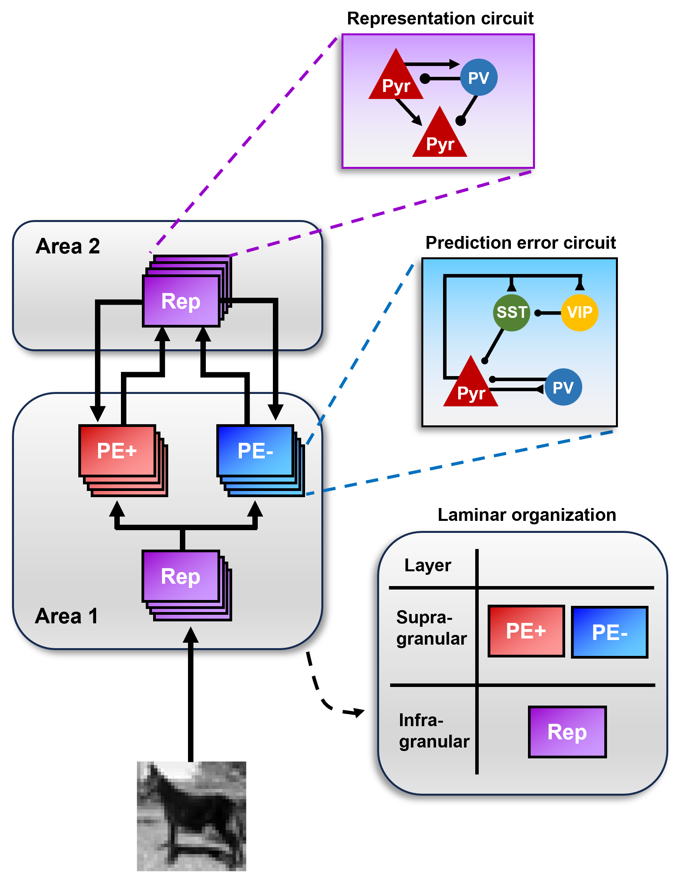
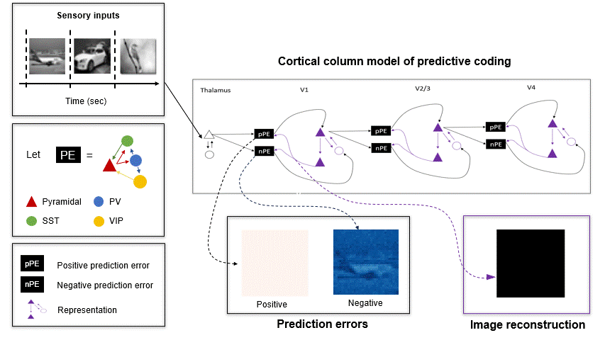
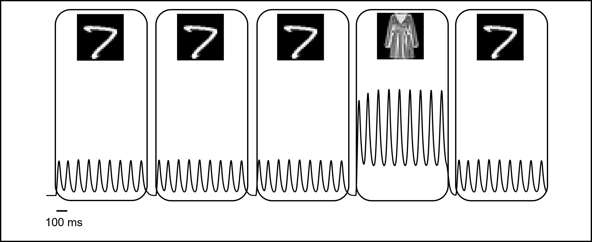
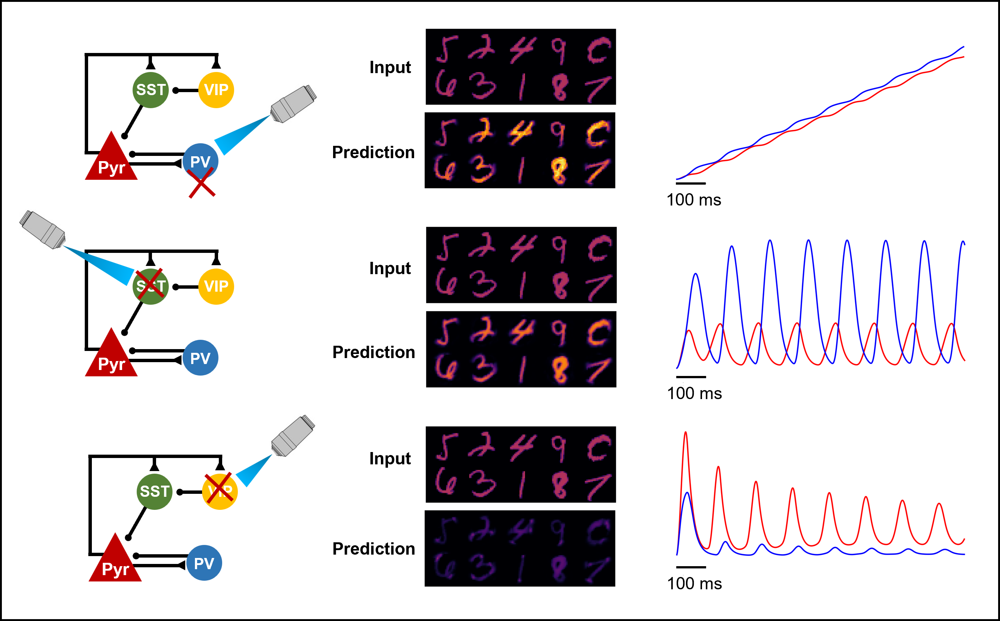

# Cortical Column model of Predictive Coding (CoCo-PC)

Predictive coding (PC) is an influential theory in neuroscience, which gives rise to a perceptual architecture of the cortex by constantly generating and updating predictive representations of sensory inputs. While its computational goal is clearly defined as prediction error minimization via hierarchical interactions between representation and prediction error neurons in cortical areas, a neural implementation that maps such a program onto cortical columns remains a challenge. In this work, we incorporate anatomical projections [1], laminar organizations [2], and the diversity of neurons [3] in the sensory cortex to the theory of PC and develop a cortical column model of PC (CoCo-PC). This involves converting the error-computing and prediction units of the classic PC network [4] based on point neuron assumption to microcircuits with four major cortical neuron types (pyramidal, PV, SST, and VIP cells), placing them in superficial and deep layers, respectively, and devising connection patterns between them to facilitate prediction error minimization circuits. The model successfully learned various image datasets (MNIST, fashion-MNIST, and grayscale CIFAR-10) via Hebbian learning, as it could reconstruct novel instances. Beyond the learning of image representations, our model captured mismatch negativity signals given a sequence of repetitive stimuli interrupted by a deviant stimulus (i.e., oddball paradigm). Interestingly, we observed oscillatory dynamics emerging in excitatory firing rates for both image reconstruction and oddball paradigms. Our simulated optogenetic silencing experiment suggests that PV cells are important for sensory suppression and generating oscillations and that SST and VIP cells have specialized roles in different prediction error circuits, revealing SST/VIP optogenetic silencing as a reliable procedure to experimentally identify positive and negative prediction errors circuits. 
    

  

  
  Figure 1. Cortical column model of predictive coding. 
  
  Each cortical column consists of one infragranular microcircuit  for representations and two supragranular microcircuits for error-computing. The representation microcircuit contains pyramidal and PV neurons and 
receives inputs from the low-level area. The two error microcircuits share intrinsic connectivity among four neuron types (pyramidal, PV, SST, and PV) but differ in extrinsic connectivity to compute positive or negative errors. The particular prediction error microcircuits were chosen after exhaustive computational search of possible combinations between the four neuron types. Each neuron behaved according to the firing rate model: 

$$\tau  \dot{r} = −r_i + f(I_i)$$
  where $i$ = pyr, PV, SST, and/or VIP.

The model inferred the causes of sensory inputs via a hierarchical interaction between two prediction error microcircuits of one cortical column (PE+ and PE- of Area 1) and one representation microcircuit from another cortical column (Rep of Area 2; Fig 1A) that iteratively minimized prediction errors. The feedforward propagation of prediction errors projected from pyramidal cells of the two error microcircuits in layer 2/3 to the representation microcircuit in layer 4. The feedback projections that convey predictions of sensory inputs were made from pyramidal cells of layer 5 of the representation microcircuit to the two error microcircuits in layer 2/3. For synaptic plasticity, the weights between prediction error and representation microcircuits were updated through Hebbian learning:

$$\dot{w}  = −\alpha_w  (r^{PE+,-}_{pyr} + r^{rep}_{pyr})$$

 

  

  
  Figure 2. Reconstruction of sensory inputs.

  When trained on 2D images, CoCo-PC learned to minimize prediction errors and reconstruct sensory inputs.

 

  

  
  Figure 3. Emergent oscillatory dynamics.

  Interestingly, we found that oscillatory dynamics emerging in both representation and prediction error microcircuits (Fig. 1C), which align with experimental observations [5]. The specific frequency of these oscillations depends on concrete parameter values.

 

  

  
  Figure 4. Oddball paradigm.

  The oscillatory dynamics persisted under an oddball paradigm: compared to repetitive stimulus, we observed increased activity in response to the deviant stimulus (i.e., mismatch negativity) in both prediction error 
microcircuits and representation microcircuit.

 

  

  
  Figure 5. Optogenetic experiment.

  To investigate the role of all interneuron types, we simulated optogenetic silencing by setting neural activity of a given neuron type ($r_i = 0$ ). Silencing PV cells disrupted the excitatory-inhibitory balance in both prediction error microcircuits, which led to runaway excitations and suppression of oscillatory dynamics. Silencing SST cells resulted in over-predictions of sensory inputs and elevated response from negative prediction error microcircuits. Silencing VIP cells showed an opposite effect of under-predictions and elevated response from positive prediction error microcircuits. Our results suggest that SST/VIP optogenetic silencing can be a reliable procedure to experimentally identify positive and negative prediction errors circuits.

 
References: 

[1] Douglas, R. J., & Martin, K. A. (1991). A functional microcircuit for cat visual cortex. The Journal of physiology, 440(1), 735-769.

[2] Bastos, A. M., Usrey, W. M., Adams, R. A., Mangun, G. R., Fries, P., & Friston, K. J. (2012). Canonical microcircuits for predictive coding. Neuron, 76(4), 695-711.

[3] Keller, G. B., & Mrsic-Flogel, T. D. (2018). Predictive processing: a canonical cortical computation. Neuron, 100(2), 424-435.

[4] Rao, R. P., & Ballard, D. H. (1999). Predictive coding in the visual cortex: a functional interpretation of some extra-classical receptive-field effects. Nature neuroscience, 2(1), 79-87.

[5] Alamia, A., & VanRullen, R. (2019). Alpha oscillations and traveling waves: Signatures of predictive coding?. PLoS Biology, 17(10), e3000487.
